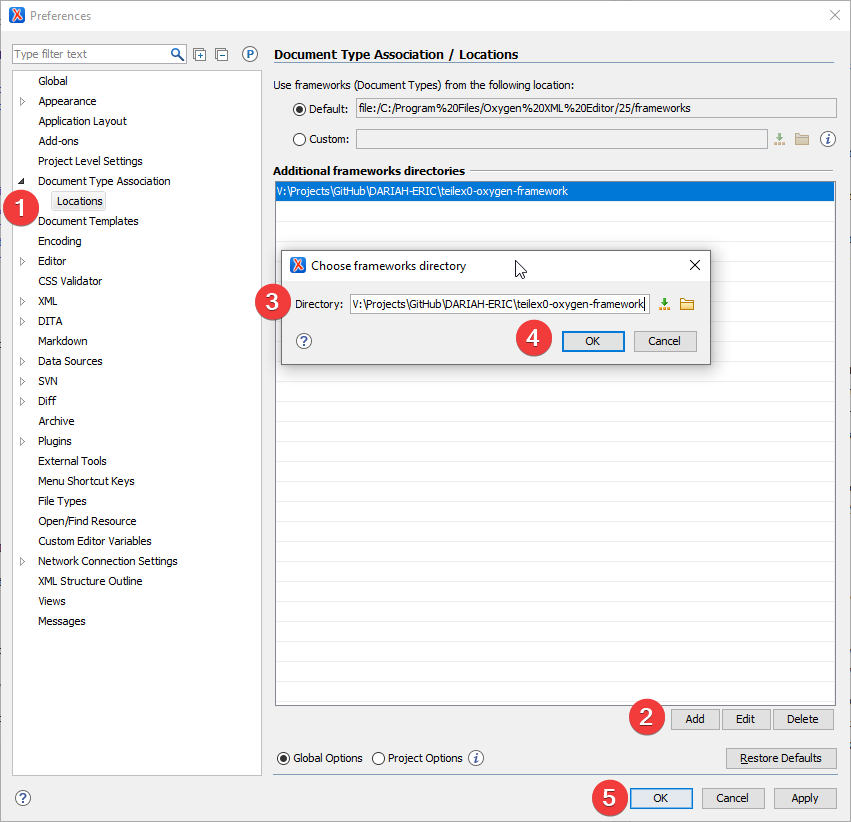
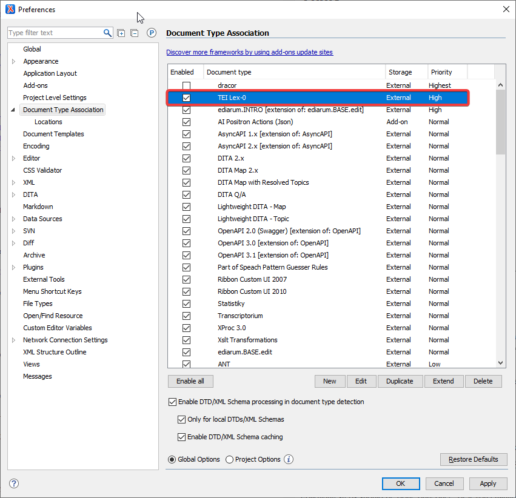

# TEI Lex-0 oXygen Framework

Add-on for [oXygen XML Editor](https://www.oxygenxml.com/xml_editor.html) with tools for editing, transforming, and analyzing dictionaries in [TEI Lex-0](https://bit.ly/tei-lex-0) format.

The framework is associated only with files from `http://www.tei-c.org/ns/1.0` namespace with `TEI` root element and `@type` attribute with value `lex-0'`. 

## Supported version of TEI Lex-0

- [0.9.2](https://github.com/DARIAH-ERIC/lexicalresources/releases/tag/v0.9.2)
- [0.9.1](https://github.com/DARIAH-ERIC/lexicalresources/releases/tag/v0.9.1)
- [0.9.0](https://github.com/DARIAH-ERIC/lexicalresources/releases/tag/v0.9.0)

## Tools

- templates
  - dictionary with teiHeader and text 
  - inserting entry with basic structure
- author view 
  - separate view of the body with entries
  - separate view of the teiHeader
  - colored parts of the text (grammar, defintion etc.)
- trnasformation scenarios 
  - extraction of the list of the headwords
  - statistics of used elements and attributes
  - export to PDF
  - merging included entries (using XInclude) in one file

## Current state

This project is in the proof-of-concept phase.

## Build

TEI Lex-0 oXygen Framework can be build using ANT: 

- run `ant` command In the root directory 

Distributed version of the framework, `teilex0-oxygen-framework.zip` file, is stored in the `web` subdirectory of the project.

## Installation

The framework can be installed uploading both files from the `web` directory (`oxygen-addons.xml` and `teilex0-oxygen-framework.zip`) to the web server and install the framework from the internet.

The installation process of the framework is described in the [documentation](https://www.oxygenxml.com/doc/versions/25.1/ug-editor/topics/installing-and-updating-add-ons.html) of the oXygen XML editor.

## Development

Download and unzip source code, or clone the Git Hub repository on your computer.

Open `teilex0-oxygen-framework.xpr` project file from the root directory of this repository in the oXygen XML Editor.

Following steps should be done only once. or if you change the location of your repository on the local disc.

In oXygen XML Editor from the `Options` menu choose `Preferences...`, then `Document Type Association` > `Locations` (1), click on `Add` button (2), select the path to the local repository (3), click on `OK` (4) in the `Choose framework directory` dialog and again `OK` (5) in main `Preferences` window.

After applying these steps there will be new item in the `Document Type Association` list called `TEI Lex-0`.

### Contribution

You can extend and change the behaviour of the oXygen XML Editor framework changing following files in the [src](./src) directory:

- `teilex0.exf`
  -  main file with settings for framework components
- `catalog.xml`
  - catalog files with the association of the external resources with local files

You can also change files in the following subdirectories:

- `css`
  - directory with Cascading Style Sheets files; edit only `.less` files, `.css` files are generating automatically after saving `.less` file. 
- `i18n`
  - translation of the user interface
- `resources`
  - different types of components used in the framework, for example transformation scenarios
- `schemas`
  - RNG or other types of schema used in the validation scenarios of edited files
  - catalog files with the association of the external resources with local files
-`templates`
  - templates for newly inserted documents, contain basic structure of valid TEI Lex-0 document
-`xproc`
  - XProc 1.0 steps used in XPRoc transformation scenarios
-`xquery`
  - XQuery files used in XQuery transformation scenarios
-`xslt`
  - XSLT files used in XSLT transformation scenarios
